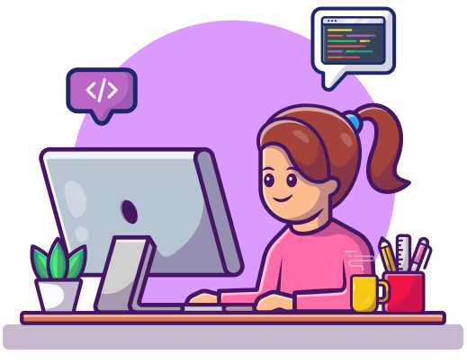

# About Me 

<table align="center" styles="border: none;">
  <tr>
    <td align="left">
      I'm a Full Stack Developer from Rio Grande do Sul, Brazil.
  
  I'm working with **Ruby on Rails** and **Next.js**, currently learning **Python**.
  
  I'm BSc Computer Science since 2021-2.
  
  Passionate to learning new languages and cultures, love animals and people, booklover and fascinated by adventure.
    </td>
    <td align="center" colspan="3"></td>
 </tr>
</table>

# GitHub Stats 

  

